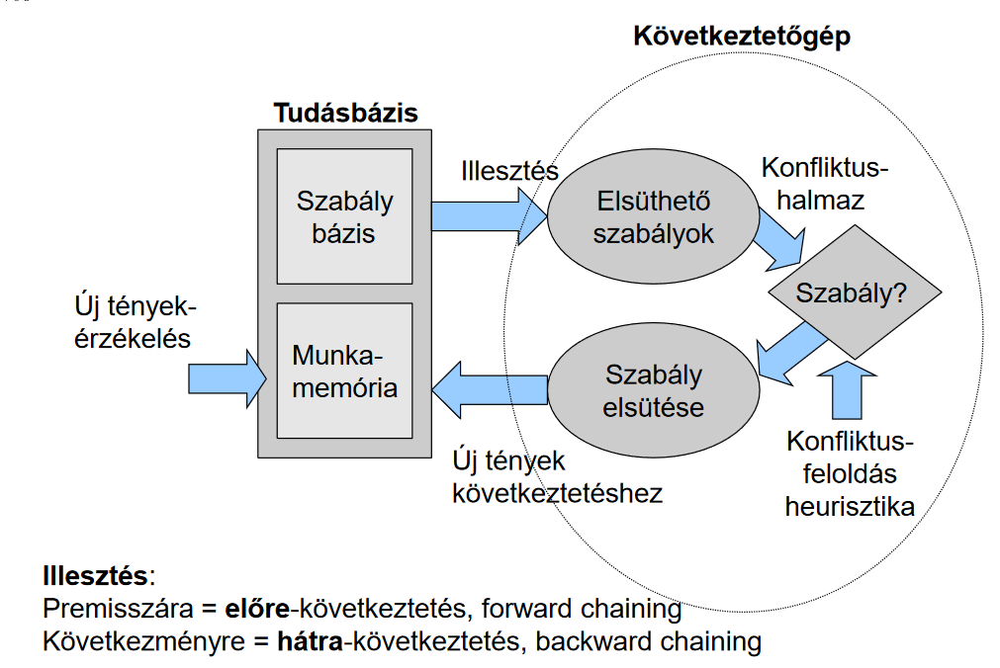

# Keresés
- **Teljesség:** teljes eljárásnak azt nevezzük, amely: ha van megoldás, biztosan megtalálja
- **Állapottérgráf vs keresési fa:** a gráfban lehet kört jelölni, de az ezzel azonos keresési fa végtelen
    - Általános fa keresés:
      

**Nem informált keresés:** a célt tudjuk, de nem tudjuk hogyan *(pl. DFS, BFS, Uniform-Cost search)*
- **Mélységkorlátozott keresés:** kipróbálja $1,2, ..., l$ mélységre korlátig $l$ limitnél megáll
- **Iteratívan mélyülő keresés:** mivel a legalsó szinteken kell a legtöbbet számolni DFS-nél, ezért inkább először $1,2,...d$ mélységi korláttal futtatunk DFS-t ($d$ az a mélységi szint lesz, ahol megtaláljuk a megoldást!)
    - d mélységen, b elágazási tényezőnél:
        - kifejtések: $(d+1) b^0 + (d) b^1 + (d - 1)b^2 + ... + 3 b^{d-2}+ 2 b^{d-1} + 1 b^d$
        *(hiszen az 0. node-ra d+1-szer vizsgálja, az 1. szinten d-szer ... a d. szinten pedig csak 1-szer vizsgál ... ezzel szemben a BFS $1+b+b^2+...$)*
        - 
- **Egyenletes költségű keresés (UCS):** mindig a legkisebb költségű csomópontot fejti ki *(feltéve, hogy pozitívak az élek)*
    - egy priority queue a határ, ahonnan szedi a következő kifejtendő élt. A prioritás a pontig összeszedett költségek
    - Teljes és optimális

**Informált keresés:** a célt tudjuk, jó becslésünk van arra is, hogy milyen költséggel érjük el
    - *Heurisztikus keresés: informált, bünteti a céltól elfelé keresést*
    - **Elfogadható heurisztika:** A heurisztika csak akkor fogadható el, ha $0 \leq h(n) \leq h^*(n)$, ahol $h^*(n)$ a valódi táv
- **Mohó keresés:** a célhoz (heurisztika alapján) legközelebbi pontot fejtsük ki
- **A* keresés:** $f(n) = g(n) + h(n)$, ahol $g(n)$ a költség $n$-be, $h(n)$ pedig a heurisztika értéke $n$-be, az így kapott $f(n)$-ből vesszük a minimálisat
    - Csak akkor állhatunk meg, ha a cél megvan és minden $f(n)$-t kifejtettünk, ami kisebb volt a célba jutásnál
    - Az A* optimális

**Gráf alapú keresés:** a fában nehéz észrevenni hogy ismétlődő állapot (kör van) $\Rightarrow$ ugyanazt a csomópontot nem fejtjük ki kétszer
    - Viszont itt a heurisztikáknál igaznak kell lennie, hogy 
    $h(A) \leq \text{valós költség C-be}$ és $h(A) - h(B) \leq \text{valós költség } A \to B$
    
#### 1. Kvíz: Keresés
- A probléma relaxációja: elhagyunk megkötéseket, megtartjuk a változókat
- h1 heurisztika dominálja h2-t, ha: h1 értéke mindig jobb, mint h2 értéke, tehát legalább akkora mint h2 

#### 2. Kvíz: Szélességi keresés
- Teljes
- Optimális, ha minden egységen 1 költségű
- Idő és tár igény is $b^d$ ($d$ a megoldás szintje)
- 

#### 3. Kvíz: A* keresés
- 
- Elfogadható a heurisztika, mert minden H(n)-re igaz, hogy kisebb, mint a valódi távolság

---

## Kényszer kielégítés
**Kényszerkielégítés (CSP - Constraint Satisfaction Problem):** úgy kell keresni, hogy vannak korlátok

- Jelölés: 
    - $X$ a változók halmaza ($x_1, x_2, ..., x_n$ változókkal) amik a megkötések szerint kell hogy értéket felvegyenek *(ezek lehetnek diszkrét vagy folytonosak - véges vagy végtelen tartománnyal)*
    - $D$ tartományok halmaza, az értékek amiket $x_i$ felvehet $D_i = \set{v_1, v_2, ...}$
    - $C$: kényszerek halmaza 
    $$c_j = <\text{amelyik változókra szól}, \text{az értékek amiket felvehetnek}>$$
    *(a megkötés lehet érték felsorolás vagy függvény is)*
        - kényszerek rendje: Unáris `(X != 2)`, Bináris `(X = Y + 2)`, Magasabb rendű: `(X != Y * Z)`

Diszkrét változókra véges tartományokon NP-teljesek a problémák
- **Kényszergráfok:** `csomópont = változó` és `él = megkötés` *(csak bináris kényszereket jelöl)*
    - Megoldások: 
        - backtrack-el: döntünk valamit és ha nem jó, akkor visszalépünk később *(lassan jön rá, ha nincs megoldás)*
        - backtrack + heurisztikák: 
            1. előre tekintés: kiszűrjük a jövőből azokat az opciókat, amik sértenek egy feltételt
            2. élkonzisztencia: $X \to Y$ él akkor és csak akkor konzisztens, ha $\forall x$ értékre $\exists y$ érték, melyre ha elfogadom $x$-et, akkor $y$ is elfogadható
            3. azt a változót válasszuk ki, ami:
                - (MRV) **legkevesebb fennmaradó érték**kel rendelkezik
                - **fokszám heurisztika:** a legtöbb szomszéddal van kapcsolatban *(ha erre nincs megoldás, akkor másra sem lesz $\Rightarrow$ hamar kiderül, ha megoldhatatlan)*
            4. **legkevésbé korlátozó érték**et rendeljük hozzá
            - Ha kör van a gráfban, amit ki kéne fejteni, akkor szedjük külön fákra és oldjuk meg ezekkel
        - Minimax: van egy értékem amit minimalizálni / maximalizálni akarok, ezért mindig olyan lépéseket választok, ami segít min/max-olni a végső értéket

## Keresés ellenséges környezetben
- Játékok típusai: determinisztikus/sztochasztikus, játékosok száma alapján, mennyi információnk van
    -  *zéró összegű játék: (ha az egyik csapat/játékos nyer, a másik veszít)*
-  *Jelölések:*
    - $S$ állapotok $s_0$ a kezdőállapot
    - $P = \set{1...N}$ játékos
    - $A$ cselekvéssel
    - $SxA \to S$ állapotátmenet függvénnyel
    - Stratégia: $S \to A$
    - V(s) egy adott állapot értéke
- Játékfa: csomópontok állapotok, élek cselekvések, végállapot = levél

**Minimax:** 2 ágens egymás után, egyik mélyégen a max értéket választja, a másikon pedig min-t (a végállapotokból visszafelé szoktuk kiszámolni)
    - 
    - Idő: $O(b^m)$
    - Tár: $O(bm)$
- **Alfa-béta nyesés:** 
    - 
    1. Elindulunk úgy, hogy $\alpha=-\infty$ és $\beta=\infty$
    2. A fa leveleinél, ha min lép utoljára, akkor ő kiválasztja azt ami rosszabb nekünk $\Rightarrow \beta=\text{amit min választ}$
    3. Megnézzük a többi részt, de nem fejtjük ki ahol van rosszabb lehetőség, mert akkor min rosszabbat választhatna
 - *Probléma:* a legtöbb játéknál nem tudunk lemenni a levelekig, így kifejteni sem

**Expectimax:** Nem tudjuk biztosan az értékeket (pl. kockadobás), de mindeközben a maximum értékre törekszünk
- Minimumok helyett várható értékeket számolunk és úgy választunk node-ot
- *kevert játékoknál: van ellenfél, de randomság is = expectiminimax*

**Monte Carlo Tree Search (MCTS):** eddig mindig úgy számoltunk, hogy tudtuk az értékeket. De amikor nem tudjuk, akkor kell venni mintákat *(adott eloszlásból / mintahalmazból)*
- 4 lépés:
    1. kiválasztás: eldönti mely állapotot bontjuk ki
    2. terjeszkedés: kibontja a fának azt a csomópontját, vagyis abban a csomópontban megvizsgáljuk, hogy mi történik ha onnan indul a játék
    3. szimuláció: véletlen módon lejátszuk az adott állapotból induló játékokat, statisztikát csinálunk
    4. visszaterjesztés: a játék eredményét felfelé terjesztjük (a/b-vel azt jelöljük, hogy `a` játékot sikerült megynerni `b` darabból) és ahol a legnagyobb lesz az esélyünk azt választjuk a fában
- Fontos probléma (exploration - exploitation) felfedezés vs kizsákmányolás

#### 4. Kvíz: Kényszerkielégítés és keresés ellenséges térben
- 
*(mert az ő fokszáma a legnagyobb)*
- 
- Minimax: 

*(itt a válasz, az, hogy melyik értéknél nyesett először. A gif-en 6-nál pl)*

---

# Logika

## Racionális döntések és hasznosság
- **Tétel:** bármely "racionális" preferencia összefoglalható hasznossági függvényként

- Milyen hasznosságokat használjunk?
    - A hasznosságok olyan függvények, amik a kimeneteleket képzik le valós számokra és leírják az ágens preferenciáit
    - *minimax érzéketlen monoton transzformációkra, ha négyzetre emeljük a fában az értékeket, semmi nem lesz*
    - Hogy tudjunk választani, be kell tartani bizonyos axiómákat:
        - Tranzitivitási axióma, ha A, B, C kimenetelekből az én értékelésem szerint: $A>B, B>C$, akkor $C \ngeq A$ *(különben nem tudok választani)*
        - Sorrendezhetőség: $(A > B) \lor (B > A) \lor (A \sim B)$, ha van egyik vagy másik preferenciám vagy semlegesek, akkor is tudok választani
        - Felcserélhetőség: $A \sim B \Rightarrow [p, A: 1-p, C] \sim [p, B; 1-p, C]$
            - vagyis ha egy nyeremény játékon A és B-nek is ugyanaz az esélye C-vel szemben, akkor a nyeremény játékok is semlegesek, ha A-t és B-t is ugyanannyira kedvelem
        - Monotonitás: $A > B \Rightarrow [p, A: 1-p, B] \geq [q, A; 1-p, B] \Leftrightarrow p \geq q$

## Tudásreprezentáció
- A logika egy tudásbázisból és egy következtető gépből áll


#### Nulladrendű logika

**Logikai következtetések fajtái:**
 - Dedukció: ha $\to$ akkor (implikáció)
    - formálisan korrekt
    - feltételből jön a következtetés *(megfigyelés alapján szabály)*
- Indukció: `ha 1-re igaz, ha 2-re igaz, ... ha n-re igaz, akkor n+1-re is`
    - nem formális, mert $n \neq \infty$ (de a valóságban nincs ennyi mintánk)
    - ez tapasztalat alapján következtetés
- Abdukció: `ha <tapasztalat> akkor <szabály>`
    - Ha több dolognak is ugyanaz a következménye, abból a szabályt nem tudjuk kitalálni *(max hipotézis)*

**Következtetés:**
- Premissza: a feltételezés $\to$ közbenső eredmények ($n$ darab) $\to$ végeredmény
- **Érvényes következtetés:** információkat felhasználja és ebből újat hoz létre
    *(állítás átalakítása nem vlaódi következtetés)*
- Vonzatreláció: $TB |= \alpha$, tudásbázis és $\alpha$ mondat között akkor áll fell vonzatreláció, ha: $\alpha$ igaz minden világra ahol $TB$ is igaz
    - Következtetés: egy új $TB |-- \alpha$ bizonyítva a TB mondataiból *(bizonyítás az algoritmus lépései)*
- Ahogy pakoljuk az állításokat a tudásbázisba, úgy lesz egyre kisebb a modell világ, ami megfelel minden állításnak *(mert ha leírom, hogy az ég kék, akkor azok a modellek nem jók, ahol az ég zöld)*
- **Következtetési eljárások:**
    - teljes: ha minden vonzatmondathoz talál bizonyítást *(igaz, ami bebizonyítható)* $A |= B$-ból $A |- B$
    - helyes: ha minden bizonyított mondat vonzatrelációban áll a tényekkel *(amit bizonyított az igaz is)* $A |- B$-ból $A |= B$
- **Egy mondat:**
    - Érvényes: minden világban minden értékkonfigurációban igaz $A \lor \lnot A$
    - Kielégíthető: ha létezik olyan interpretáció, hogy valamely világban igaz
        - *(Ami érvényes az kielégíthető)*
    - Kielégíthetetlen: ami nem kielégíthető (sohasem igaz $A \land \lnot A$)

#### Ítéletkalkulus
- Egyszerű logikai operátorokat használunk
- precedencia: $\lnot, \land, \lor, \to, \Leftrightarrow$
- 
- Következtetés: ha a felsőt tudjuk, akkor a vonal alattit beírhatjuk a tudásbázisunkba


- Az ítéletlogika monoton: új mondatot mindig csak úgy vehetünk hozzá, hogy az eddigieket ne sértse. Vagyis az igaz mondatok száma csak nőni tud. *(változó világot nehéz leírni)*
Horn-klózzal következtetés:
- 
*(nem minden TB állítás írható fel így)*

- Az előrecsatolt / hátracsatolt következtetés: építünk egy fát az állításokból és vagy az igaz megállapításokból előrefelé lépkedve bizonyítjuk a dolgokat, vagy a céltól visszafelé lépkedünk egészen addig, amíg elegendő igaz állítást nem találunk, hogy a cél levezethető legyen

- Feltétel ellenőrzése: pl. az a kérdés, hogy $R$ igaz-e? Akkor azt válaszoljuk meg, hogy $\lnot R$ feltételnél ellentmondásba kerül a tudásbázis, vagyis üreshalmaz-e a hozzátartozó világ

#### 5. Kvíz: Ítéletlogika
- 

#### Elsőrendű logika
> Sajnos a világ nem olyan egyszerű, mint ahogy az ítéletkalkulus leírja, ennél több kell

- Modellezés:
    - Objektumok: tulajdonságokkal, függvényekkel rendelkeznek (pl. te, Bodri ...)
    - Relációk: n-esek (pl. Bátyja(Jani, Anna), Lop(politikus, tolvaj, adócsaló), János = apja(Béla))
- Szintaktika:
    - Konstans szimbólumok: Bodri
    - Predikátumok: Bátyja(Jani, Anna)
    - Függvények: János = apja(Béla)
- Ezekből atomok állíthatók össze
- Összetett mondatokhoz:
    - logikai szimbólumok: $\lnot, \land, \lor, \to, \Leftrightarrow$
    - kvantorok: $\forall, \exists$ 
    - egyenlőség: `(term1 = term2)` ~ akkor és csak akkor
- Bizonyítások: nehéz, mert olyan objektumokat keresünk, amikre igazak a dolgok
    - Redukció: változók nélküli predikátum kalkulus = ítélet kalkulus
    ```
    kutya(Bodri)                                            x1
    nagytestű(Bodri)                                        x2
    kutya(Bodri) ^ nagytestű(Bodri) → fél(Béla,Bodri)       x1 ^ x2 → x3
    ```
- Predikátum kalkulus:
    - Teljes: minden igaz állítás bebizonyítható vele
    *(az ítéletkalkulusnál be lehet bizonyítani, hogy valami igaz/hamis, itt meg lehet hogy végtelen ciklusba kerülhetünk $\lnot \exists x : nem_az_univerzum_tagja(x)$, mert mindent be kell helyettesíteni)*
    - Modus ponens itt: $p(A)$ és $\forall x, p(x) \to q(x)$, beírhatjuk a tudásbázisba, hogy $q(x)$
    - Bizonyításnál eliminálni kell a kvantorokat, amik bizonyos esetekben elhagyhatók 

#### 6. Kvíz: Elsőrendű logika
- $\lnot \forall X \text{ valami}(X, b) \Leftrightarrow \exist X \lnot \text{ valami}(X,b)$ 

###### Ontológiák
- Ontológia típusok:
    - Az első rendű logika erős szemantikával rendelkezik, de a világot kevésbé írja le
    - Középút: UML, RDF/S, aminek kevésbé erős a szemantikája, de a világot jobban leírja
    - Taxonómiák: gyenge szemantika, erős leírás a világról

---

# Döntések

#### Valószínűségi modellezés és következtetés
> Sokszor nehzéz direkt megfigyeléseket csinálni, ilyenkor a dologban részt vevő tényezők alapján szeretnénk eloszlásokat nézni (pl. nap, felhők, hideg/meleg $\rightarrow$ eső)

- Modell: megfigyelt változók + ismeretlen változók, ha változók kapcsolatairól vannak megfigyeléseink
- *Valszám ismétlő:* 
    - Valószínűségi változó: olyan függvény, ami bizonyos értékeket vehet fel (pl. $X: \set{\text{felhős}, \text{tiszta}}$)
    - Valószínűségi eloszlás: melyik értékhez milyen valószínűség tartozik (feltétel: $\forall x\ P(X = x) > 0 \text{ és } \sum_x P(X=x)=1$)
    - Együttes eloszlás: több véletlen változó valószínűsége együttesen *(pl. esik és meleg van)*
        - Marginális eloszlás: adott változó szerinti összegzéssel adott változó valószínűségei *(pl. esik=igaz, esik=hamis szummázásával meglesz $P(X=\text{esik})$ és $P(X=\text{nem esik})$)*
- **Számolások:**
    - Bayes tétel: $\displaystyle P(x|y) = \frac{P(y|x)}{P(y)} \cdot P(x)$
    *(ez segít nekünk megfigyelésből hipotézist felállítani)*
    - Szorzat szabály: $P(x, y) = P(y)P(x | y)$
    - Láncszabály: $P(x_1, x_2, x_3) = P(x_1)P(x_2 | x_1)P(x_3 | x_1, x_2)$
    - Függetlenség: $P(x, y) = P(x) \cdot P(y)$
- **Likelihood:** ismerjük az eloszlást, tudni akarjuk milyen valószínűséggel fordul elő valami $P(\text{Dice} | \text{Weighted})$
- **Posteriori valószínűség:** ha megfigyelünk valamit, akkor mennyi a valószínűsége, hogy adott eloszlásból jött $P(\text{Weighted} | \text{Dice})$

**Bayes háló:**
1. csomópontok: a valószínűségi változók
2. irányított élek: $X \to Y$, ha X-nek közvetlen befolyása van X-re
3. Minden csomópont  egy kis együttes eloszlás résztáblát jelöl *(X és a rá ható "szülők" egy táblában)*
4. A gráf DAG *(ha lenne kör, akkor körbe függenének)*
    

- *Minden csomópont feltételesen független a leszármazottjaitól*
- Függetlenség haszna:
    - Ha minden változó bináris lenne és 1 nagy együttes eloszlás táblába kerülnének, akkor $2^n-1$ sora (szabad paramétere) lenne 
    *($-1$, mert az utolsó sor kiszámolható $1 - P(\text{többi})$)*
    - Viszont, ha teljesen függetlenek lennének, akkor csak $n$ darab szabad paraméter van. A Bayes háló is ilyen egyszerűsítéssel éri el, hogy ne kelljen gigászi táblákat számon tartani
- **Markov takaró:** egy adott csomópont szülői és gyerekei *(a háló többi pontja nem befolyásolja ezt a pontot - szülők szülei sem)*

A háló általánosan:
1. a háló egy együttes valószínűségi eloszlás leírása
2. a háló a feltételes függetlenségről szóló állítások együttese
- Háló megépítése:
    1. probléma változóinak meghatározása
    2. sorrend meghatározása
    3. Amíg maradt érintetlen változó: $X_i$-t válasszk ki és adjunk egy csomópontot a hálóhoz. Legyen a $\text{Szülők}(X_i)$, a minimális halmaz amik hatnak $X_i$-re
    4. Definiáljuk $X_i$ feltételes valószínűségi tábláját

Naív Bayes-hálók: *(egyszerűbb háló, de egész pontos)*
- kétféle csomópont létezik: ok/következmény
- a következmények egymástól feltételesen függetlenek *(csak 1 szülő = ok van)

**Következtetés valószínűségi hálókban:**


#### Kvíz 7. Bayes-szabály
- 
- 
- 

#### Kvíz 8. Bayes-hálók
- 
    - C-nél azért így, mert minden sorban $1-P(\text{adott sor})$ az elhagyott változó valószínűsége
- 

#### Kvíz 9. Következtetés Bayes-hálókban
- 
    *Ezt már picit bonyolultabb megoldani, de simán menni fog*
    1. Meg kell állapítani, hogy mit tudunk: `P(J=1|B=1, E=1)`
    Az összes változóból tudjuk E-t és B-t és J-re vagyunk kíváncsiak, vagyis A és M nem ismert.
    2. A nem ismertek helyére minden lehetőséget be kell helyettesíteni $\Rightarrow$ sum-ot használunk:
    $P(J=1|B=1, E=1) = \sum_a \sum_m P(B=1, E=1, A=a, J=1, M=m)$
    Ezt ki lehet még fejteni (úgy, hogy mindenki csak a szülőjétől függ, ezért velük szorzunk):
    $= P(B=1) \cdot P(E=1) \sum_a P(a | B=1, E=1) \cdot P(J|a) \cdot \sum_m P(m|a)$
    *Ott ahol mindkét változó ismeretlen, azt el lehet hagyni (mert az összes variáció kipróbálása = 1 lesz)*
    $= P(B=1) \cdot P(E=1) \sum_a P(a | B=1, E=1) \cdot P(J|a)$
    3. Ennek a kifejezésnek a fa reprezentációját is ideteszem hátha segít *(amiket tudunk, azoknak valószínűsége 1)*
    
    4. Akár a képletből, akár a fából így kiszülhetjük az eredményt:
    $\displaystyle 1 \cdot 1 \cdot \left( (0.05 \cdot 0.1  \cdot 1) + (0.95 \cdot 0.84 \cdot 1) \right) = 0.802999$

##### Logikai mintavételezés
> Néha nagy hálóknál bonyolult számolgatni, úgyhogy vannak módszerek, amikkel megtudhatunk valószínűségeket

- Sztochasztikus szimuláció: valószínűséget úgy szimulálunk egy ilyen hálóban, hogy random sorsolunk *(pl. a betörést sorsoljuk adott esélyel és utána a háló többi eldöntetlen részén is ottani esélyekkel sorsolunk)*
- Elutasító logikai mintavételezés: csinálunk egy csomó mintát és csak azokat használuk, amik megfelelnek a lekérdezésnek
- Valószínűségi súlyozás: legeneráljuk az összes mintát a táblázatok alapján, de úgy, hogy amiket tudunk azokat beállítjuk (a kicsi valószínűségű dolgokat lassú így megtalálni)
- Markov Chain Monte Carlo mintavételezés: amiket tudunk, azokat lefixáljuk, a többi szabad állapotot meg véletlenszerűen gyúrjuk
  
### Döntési hálók  
- Maximális várható hasznosság - MEU (max estimated usefullness): 
    - Új jelölések: 
    
- **Döntési hálók:** vannak állapotok, amik bizonyos valószínűséggel jönnek létre. Ezekre nekünk döntéseket kell hozni, amikért jutalmat kapunk. 
*(pl. 60% hogy eső lesz, ha viszek esernyőt és nem ázok el +20 social credit, de ha viszek és nem esik, akkor -10 mert akadályoz a villamoson)*
    - A döntési hálók előnye, hogy előre látható az eredményük, mindig csak a saját hasznosságuk akarják maximalizálni.
    - Egylépéses / többlépéses is lehet attól függően, hogy hány cselekvést hajt végre meg mennyi tényezőt vesz figyelembe
- **Szekvenciális döntési problémák:**
    - Lehet végtelen / végtelen horizont
    - **Leszámítolás:** a cél elértéktelenedik idővel *(ez azért jó, mert minél hamarabb érjük el, annál többet ér)*
        - Policy: végtelen esetben érdemes maximalizálni a jutalmat, az eljárás mód, ami maximalizálja a várható hasznossági értéket
    - **Bellman-egyensúlyi egyenlet:**
    $\displaystyle U(s) = R(s) + \gamma \cdot \underset{a}{\max} \sum_{s'} T(s, a, s') U(s')$
        - Adott állapot hasznossága, ahol $s$ állapotban $R(s)$ reward mellett a $\gamma$ leszámítolási tényezővel megnézzük a következő álapotokat. 
        A következő összes $a$ action-t megvizsgáljuk, amik átvisznek $s'$ állapotba
        - Ha van véletlenség a rendszerben, akkor $T(s,a,s')$ állapotátmenet több $s'$-be is vezethet minket
